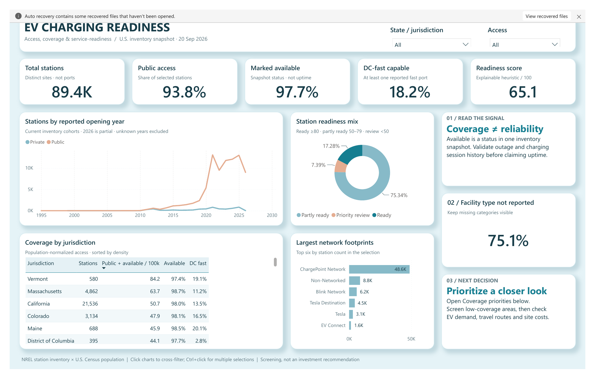
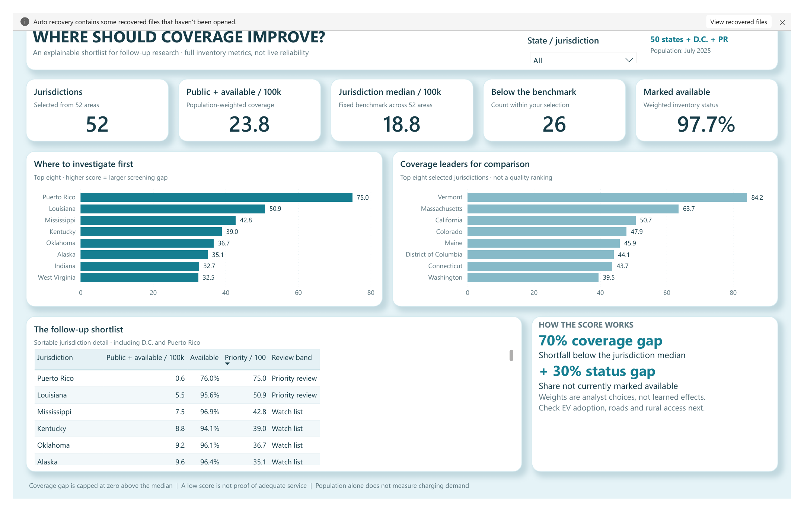

# EV Charging Readiness & Accessibility

**Where should public charging coverage improve—and what should be checked before recommending expansion?**

A Python and Power BI analysis of **89,394 charging stations**, joined to population estimates for **50 U.S. states, Washington, D.C., and Puerto Rico**. The project separates how much charging exists, who can access it, and which areas deserve closer investigation.

## Dashboard

### Network overview



### Coverage priorities



These images are exported directly from the working report. Charts, KPI cards, tables and slicers are native, interactive Power BI visuals—not a background image.

- [Download the ready-to-open report](power_bi/EVChargingReadiness.pbix)
- [Browse the editable Power BI project](power_bi/EVChargingReadiness.pbip)
- [Read the executed preprocessing notebook](notebooks/ev_charging_preprocessing.ipynb)
- [Model, measures and refresh instructions](power_bi/dashboard_build.md)
- [Download the exported dashboard PDF](outputs/dashboards/EVChargingReadiness.pdf)

## Findings: September 20, 2026 snapshot

| Metric | Result |
|---|---:|
| Distinct station locations | 89,394 |
| Public access | 93.8% |
| Marked available | 97.7% |
| At least one reported DC fast port | 18.2% |
| Mean readiness score | 65.1 / 100 |
| Jurisdiction median: public-and-available stations / 100,000 residents | 18.76 |

- **Station count alone is misleading.** Vermont leads this snapshot in population-normalized public-and-available coverage at 84.23 stations per 100,000 residents; California records 50.68.
- **Louisiana, Mississippi and Kentucky warrant closer study among the states.** Their screening scores are 50.9, 42.8 and 39.0. Puerto Rico scores 75.0, but its small inventory of 25 stations needs particular caution when interpreting rates.
- **Missing data is a finding.** Facility type is unspecified for 75.1% of stations. Those records remain visible; they are not assigned a guessed category.

The recommendation is a research shortlist, not a site-investment decision. Validate EV adoption, travel demand, rural access, outage history and site economics before selecting locations.

## Sources and scope

| Source | Used for |
|---|---|
| [NREL Alternative Fuel Stations API](https://developer.nrel.gov/docs/transportation/alt-fuel-stations-v1/all/) | Station ID, access, status, network, charging ports, location and reported opening date |
| [U.S. Census Bureau population estimates](https://www.census.gov/data/datasets/time-series/demo/popest/2020s-state-total.html) | Vintage 2025 population denominator |

The extraction timestamp and actual endpoint are recorded in [source metadata](data/raw/source_metadata.json). The processed snapshot is committed. Large raw downloads and local Power BI caches are excluded. Rerunning the download retrieves a newer inventory, which may change the results.

## Analysis approach

1. Download the station inventory and population file; preserve the extraction timestamp.
2. Standardize status, access, network and facility labels; parse dates and numeric port counts.
3. Validate station IDs, geographic keys, nonnegative counts and expected categories.
4. Join station aggregates to Census population with a one-to-one jurisdiction key.
5. Calculate coverage, readiness and a transparent screening priority.
6. Export clean tables, execute the notebook and compare Power BI measures with Python results.

### Data preparation and analysis

The notebook separates reproducible preparation from analysis. It keeps unknown labels visible, converts source dates and counts to usable types, adds missing-value flags for numeric model features, and uses medians only for the separate analysis matrix. Low-cardinality fields (`access_label`, `status_label`, `facility_type_label` and `readiness_band`) are one-hot encoded with `pandas.get_dummies` in `data/processed/station_features_encoded.csv`; the reporting fact table remains readable for Power BI.

The analysis compares population-normalized coverage, availability, fast-charging capability, network footprint, facility mix, readiness bands and current-inventory opening cohorts. The accompanying Python figures are exploratory checks; the interactive report is the final presentation layer.

### Metric definitions

**Coverage** = public-and-available station locations ÷ population × 100,000. Totals use a ratio of sums, not an average of state rates. A station location is not a charging port.

**Readiness score (0–100)** = 30 points for public access + 30 for available status + 25 for a reported DC fast port + 10 for at least four reported ports + 5 for pricing information. Bands: Ready ≥80; Partly ready 50–79; Priority review <50.

**Jurisdiction priority (0–100)** = 70% coverage gap + 30% status gap:

```text
coverage gap = max(0, median coverage - jurisdiction coverage) / median coverage × 100
status gap   = (1 - availability rate) × 100
```

The benchmark is the median across all 52 jurisdictions. Weights are analyst assumptions, not empirically estimated effects. Priority is a fixed snapshot metric, so the second report page offers jurisdiction filtering without an access filter that would change its meaning.

## Reproduce the project

```powershell
python -m venv .venv
.venv\Scripts\Activate.ps1
python -m pip install -r requirements.txt
python scripts\download_data.py
python -m nbconvert --to notebook --execute --inplace notebooks\ev_charging_preprocessing.ipynb
python scripts\validate_project.py
```

The notebook contains 11 executed code cells with saved outputs and assertions. It calls the reusable preprocessing functions in [scripts/prepare_data.py](scripts/prepare_data.py). For a script-only run, use `python scripts\prepare_data.py` after downloading.

The API defaults to `DEMO_KEY`. If needed, set your own key in the `NREL_API_KEY` environment variable; never commit keys.

To rebuild the editable report for your local clone:

```powershell
python scripts\build_powerbi.py
python scripts\validate_project.py --schemas
```

Open `power_bi/EVChargingReadiness.pbip` in Desktop, refresh and save. The builder sets `ProjectRoot` to your clone's location. Alternatively, change that parameter under **Transform data → Edit parameters**. The PBIX includes the saved snapshot and opens without downloading source data.

## Repository guide

| Folder | Contents |
|---|---|
| `notebooks/` | Executed preprocessing and validation notebook |
| `scripts/` | Download, clean, build and validate workflows |
| `data/processed/` | Station fact, jurisdiction metrics, supplementary summaries and dictionary |
| `power_bi/` | Populated report, editable definitions and model notes |
| `outputs/dashboards/` | Actual report screenshots |
| `outputs/figures/` | Supplementary Python exploratory charts |
| `data/processed/station_features_encoded.csv` | Analysis-ready numeric and one-hot encoded feature matrix |

## Limitations

- Availability is a source status at extraction, not charger uptime or a successful session.
- Population does not capture EV ownership, visitors, traffic or urban/rural geography.
- Missing port counts become zero reported ports, not proof that physical chargers do not exist.
- Opening-year charts describe stations still in the current inventory, not all historical openings. Unknown years are excluded, and 2026 is incomplete.
- The score rewards reporting completeness and infrastructure attributes, not observed customer outcomes.
